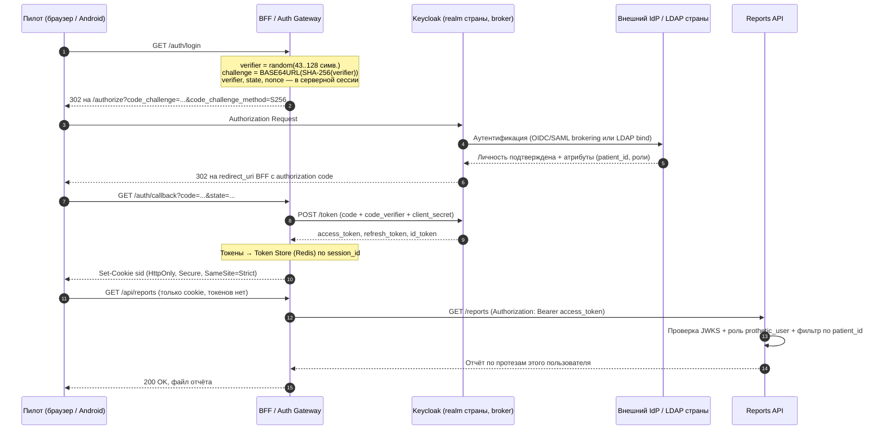

ЗАДАНИЕ 1. ПОВЫШЕНИЕ БЕЗОПАСНОСТИ СИСТЕМЫ BionicPRO

Документ описывает архитектурное решение по управлению учётными данными пользователей (Задача 1)
и выполненную доработку приложения — переход с «голого» Authorization Code Grant на Code Grant + PKCE (Задача 2).
Опирается на кейс BionicPRO 9 спринта и на код, собранный в уроках темы 1.
Инициативы I-1…I-3 раскрываются далее в Задании 2 (отчёт из CRM и ClickHouse).

Статус: Accepted. Дата: 08-08-2026.
Диаграмма: [BionicPRO_C4_container_to-be.drawio](BionicPRO_C4_container_to-be.drawio) (C4, уровень Container, целевое состояние).

---

## 1. Краткое резюме (TL;DR)

Взлом стал возможен не из-за выбора Code Grant, а из-за того, что **токены IdP оказались доступны JavaScript в браузере** (A1) и **публичный клиент обменивал authorization code без доказательства владения** (A2). Плюс отсутствие авторизации на данных: любой аутентифицированный пользователь мог получить отчёт по чужому протезу (B1).

Целевое решение состоит из трёх опор:
1. **BFF / Auth Gateway** — единственный владелец токенов; фронтенду отдаётся только `HttpOnly`-cookie с идентификатором серверной сессии. Токены, полученные от IdP, фронтенд не видит никогда.
2. **Keycloak в роли Identity Broker + User Federation** — учётные записи запрашиваются из внешнего источника (LDAP/AD, национальная удостоверяющая служба) в стране представительства; пароли и ПДн юрисдикцию не покидают.
3. **PKCE S256 как обязательный режим** для всех OAuth-клиентов + RBAC на роли `prothetic_user` со скоупом данных по `patient_id`.

Задача 2 выполнена в коде: PKCE включён на фронтенде и принудительно требуется Keycloak, ROPC-поток отключён.

---

## 2. Анализ системы: ключевые наблюдения

| Наблюдение | Почему это важно для безопасности |
|---|---|
| `reports-frontend` — public client, SPA держит `keycloak.token` в памяти/`localStorage` адаптера | Публичный клиент не может хранить секрет, а любая XSS или скомпрометированная npm-зависимость даёт доступ к **refresh**-токену — то есть к длительному доступу от имени пользователя |
| В `realm-export.json` включён `directAccessGrantsEnabled: true` | ROPC-поток: пароль пользователя проходит через код фронтенда, обходит MFA и брутфорсится напрямую по `/token` |
| Роли `user` / `administrator` / `prothetic_user` заведены, но нигде не проверяются | Авторизация фактически = аутентификация; данные чужих протезов доступны |
| В `ldap/config.ldif` уже есть группы `user` / `prothetic_user` | Внешний источник учётных данных заложен, но не подключён — источник истины дублируется |
| Данные в одной PostgreSQL, ClickHouse ещё нет | Аналитика по телеметрии конкурирует с OLTP; отчёт нельзя построить, не деградируя CRM |
| Компания работает в одной юрисдикции, но планирует выход в другие | Схема «один глобальный realm» после выхода на новый рынок станет юридическим блокером, а не техдолгом |

---

## 3. Идентификация проблем

**A. БЕЗОПАСНОСТЬ ИДЕНТИФИКАЦИИ**
- **A1.** Access- и refresh-токены, полученные от IdP, доступны коду в браузере → XSS или компрометация зависимости даёт злоумышленнику долгоживущий доступ к API → массовая выгрузка ПДн.
- **A2.** Authorization Code без PKCE у публичного клиента → перехваченный `code` (открытый редирект, логи прокси, вредоносное приложение с тем же custom scheme на мобильном) обменивается на токены без доказательства владения.
- **A3.** Включён Direct Access Grants (ROPC) → пароль ходит через фронтенд, MFA обходится.
- **A4.** `Access-Control-Allow-Origin: *` в `frontend/nginx.conf` и wildcard в `redirectUris` → расширенная поверхность утечки кода и токена.

**B. АВТОРИЗАЦИЯ И ДОСТУП К ДАННЫМ**
- **B1.** `/reports` не проверяет ни роль, ни принадлежность протеза пользователю → горизонтальное повышение привилегий (IDOR); ровно этим и воспользовались хакеры.
- **B2.** RBAC описан в realm, но не доведён до приложения — роли не влияют ни на что.
- **B3.** Нет аудита выдачи отчётов и алертинга на аномальный объём → факт выгрузки обнаружен из СМИ, а не из мониторинга.

**C. УЧЁТНЫЕ ДАННЫЕ И ГЕОГРАФИЯ**
- **C1.** Учётные записи живут только внутри Keycloak → нет унификации доступа с корпоративными и внешними каталогами, заведение пользователя в каждой стране ручное.
- **C2.** Нет механизма подключения национальных удостоверяющих служб (ЕСИА, eIDAS, IdP клиник-партнёров).
- **C3.** Авторизационные, персональные и медицинские данные не привязаны к юрисдикции → блокирует выход на новые рынки (152-ФЗ ст. 18 п. 5 для РФ, GDPR гл. V для ЕС, HIPAA для США).

**D. ДАННЫЕ И ПРОИЗВОДИТЕЛЬНОСТЬ** (контекст, закрывается в Задании 2)
- **D1.** Единая PostgreSQL под OLTP и аналитику деградирует; индексы не помогли — нужен отдельный аналитический контур.

---

## 4. Требования к решению

Архитектурно значимые помечены **АЗТ**.

**Функциональные**
| Код | Требование |
|---|---|
| F1 | Пользователь входит через SSO с использованием Authorization Code + PKCE |
| F2 | Пользователь скачивает отчёт о работе **своих** протезов из Android-приложения и веб-кабинета |
| F3 | Пользователь может войти через внешнюю удостоверяющую службу своей страны |
| F4 | Администратор управляет доступом через роли, а не через правку кода |
| F5 | Все обращения к отчётам логируются с идентификатором пользователя и correlation_id |

**Нефункциональные**
| Код | Требование | АЗТ |
|---|---|---|
| NFR1 | Токены, выданные IdP, недоступны коду в браузере ни при каких условиях | **АЗТ** |
| NFR2 | Перехваченный authorization code без `code_verifier` непригоден для обмена | **АЗТ** |
| NFR3 | Пользователь получает только данные своих протезов (проверка на сервере) | **АЗТ** |
| NFR4 | Учётные данные запрашиваются из внешнего источника страны представительства; пароли и ПДн не покидают юрисдикцию | **АЗТ** |
| NFR5 | Подключение новой удостоверяющей службы — конфигурацией, без изменения кода приложений | **АЗТ** |
| NFR6 | Время жизни access-токена ≤ 5 мин, refresh — только на серверной стороне, rotation включён | |
| NFR7 | Все внешние взаимодействия по TLS 1.2+; LDAP только LDAPS | |
| NFR8 | Аудит событий входа/отказа/выдачи отчёта с retention ≥ 1 год, алерт на аномальный объём выгрузки | |

---

## 5. Инициативы

| Код | Инициатива | Что делаем | Закрывает |
|---|---|---|---|
| **I-1** | BFF / Auth Gateway | Confidential-клиент на сервере: выполняет обмен `code`→токены, хранит токены в Redis, отдаёт браузеру `HttpOnly`-cookie | A1, A4 (NFR1, NFR6) |
| **I-2** | PKCE S256 везде | Включить PKCE в SPA и мобильном приложении, сделать обязательным на стороне Keycloak, отключить ROPC | A2, A3 (NFR2) |
| **I-3** | RBAC + скоуп данных | Проверка роли `prothetic_user` и фильтрация по `patient_id` из токена на стороне Reports API | B1, B2 (NFR3) |
| **I-4** | User Federation | Keycloak читает учётные записи из LDAP/AD страны представительства (read-only, LDAPS) | C1 (NFR4) |
| **I-5** | Identity Brokering | Подключение внешних IdP (ЕСИА, eIDAS, IdP клиник) как identity providers realm'а | C2, C3 (NFR5) |
| **I-6** | Аудит и алертинг | События Keycloak и BFF → OpenTelemetry → SIEM, пороги на объём выгрузки | B3 (NFR8, F5) |

Приоритизация: **если бы можно было сделать только три — I-2, I-1, I-3**, потому что именно они закрывают уже реализованный вектор атаки (кража токена + отсутствие проверки владельца данных). I-4/I-5 — про выход на рынки, боль будущая; I-6 не предотвращает атаку, но сокращает время её обнаружения.

---

## 6. Задача 1. Архитектурное решение

### 6.1. Обзор

Целевое состояние — на диаграмме [BionicPRO_C4_container_to-be.drawio](BionicPRO_C4_container_to-be.drawio).
Легенда цвета (по палитре ARCH-STYLE, смысл закреплён для этого домена):

| Цвет | Значение |
|---|---|
| Серый `#F5F5F5` | существующий контейнер (as-is) |
| Зелёный `#D5E8D4/#82B366` | новый контейнер — безопасная работа с токенами (BFF, Token Store, Reports API) |
| Оранжевый `#FFE6CC/#D79B00` | новый или внешний — федерация учётных данных и локализация данных (LDAP, внешние IdP, ClickHouse, Airflow, аудит) |
| Красный `#F8CECC/#B85450` | изменённый существующий контейнер (Reports SPA, Keycloak) |

### 6.2. Решение 1 — где живут токены (закрывает A1, NFR1)

| Вариант | Плюсы | Минусы / почему не как основа |
|---|---|---|
| SPA хранит токены сама (as-is) | Ничего не надо строить; работает из коробки в keycloak-js | Любая XSS = кража refresh-токена. Это и есть реализованный вектор атаки. Отклонён |
| Токены в `HttpOnly`-cookie, выданные напрямую IdP | Cookie недоступна JS | Keycloak так не умеет без прослойки; остаётся CSRF; фронтенд всё равно завязан на IdP |
| Токены в Service Worker / Web Worker | Токен изолирован от основного контекста | Защита разрушается при XSS в самом воркере, сложная отладка, зависимость от поддержки SW в WebView мобильного приложения |
| **BFF / Token Handler (ВЫБОР)** | Токены не покидают сервер; браузер получает только opaque `sid`; логаут отзывает сессию централизованно; фронтенд не знает про OAuth | Дополнительный контейнер и сетевой хоп (+5–15 мс); нужна защита от CSRF (`SameSite=Strict` + anti-CSRF-токен на мутирующие запросы) |

**Итог: BFF** — единственный вариант, который делает утечку токена через фронтенд структурно невозможной, а не «маловероятной». Рекомендация OAuth 2.0 for Browser-Based Apps (BCP) — та же.

Cookie: `Set-Cookie: sid=<opaque>; HttpOnly; Secure; SameSite=Strict; Path=/`. В Token Store (Redis) — `session_id → {access_token, refresh_token, expires_at}` с TTL и шифрованием at-rest.

### 6.3. Решение 2 — унификация доступа и внешний источник учётных записей (закрывает C1, NFR4)

| Вариант | Плюсы | Минусы / почему не как основа |
|---|---|---|
| Пользователи только в Keycloak (as-is) | Просто | Второй источник истины; в каждой стране ручное заведение; не отвечает требованию «запрос УЗ из внешнего источника» |
| Разовая миграция пользователей из LDAP в Keycloak | Быстрый старт | Копия ПДн вне исходной юрисдикции → нарушает принцип локального хранения. Отклонён |
| Свой сервис идентификации | Полный контроль | Переписывание OIDC/SAML своими руками — главный источник уязвимостей. Отклонён |
| **Keycloak User Federation (LDAP/AD) + Identity Brokering (ВЫБОР)** | УЗ запрашиваются из источника в стране, `Import Users: off` — атрибуты не кэшируются постоянно; bind-аутентификация выполняется на стороне каталога, пароль в Keycloak не попадает; подключение конфигурацией | Доступность каталога становится критичной для входа (лечится read-репликой каталога и кэшем сессий); маппинг атрибутов нужно поддерживать |

**Итог: федерация вместо копирования.** Keycloak выступает точкой унификации доступа, но не владельцем персональных данных.

### 6.4. Решение 3 — мультирегиональность (закрывает C3, NFR4/NFR5)

| Критерий | Один глобальный Keycloak, realm на страну | **Региональная инсталляция, realm на страну (ВЫБОР)** | Отдельный продукт на страну |
|---|---|---|---|
| 1. Соответствие 152-ФЗ / GDPR | Нет: БД Keycloak с сессиями и атрибутами лежит в одной стране | Да: БД, каталог и ПДн — в юрисдикции | Да |
| 2. Стоимость эксплуатации | Низкая | Средняя (N инсталляций по IaC-шаблону) | Высокая |
| 3. Скорость выхода на новый рынок | Высокая | Высокая: развернуть шаблон + подключить локальный IdP | Низкая |
| 4. Единый код приложений | Да | Да (разница только в `issuer`/realm URL) | Нет, форк на страну |
| 5. Vendor lock-in | Keycloak (Apache 2.0) | Keycloak (Apache 2.0) | — |

**ВЫБОР: региональная инсталляция периметра (Keycloak + БД + CRM-хранилище ПДн) на страну представительства, realm на страну.** Обоснование: только этот вариант одновременно удовлетворяет требованию локального хранения и сохраняет единую кодовую базу. Глобальный Keycloak дешевле, но юридически неприменим уже на втором рынке; отдельный продукт решает право ценой утроенной стоимости разработки.

Кросс-региональные данные (обезличенная телеметрия для обучения ML-модели) допускается реплицировать глобально **только после псевдонимизации**: `patient_id` заменяется на региональный суррогат, таблица соответствия остаётся в стране.

### 6.5. Решение 4 — PKCE вместо «голого» Code Grant (закрывает A2, A3, NFR2)

| Вариант | Плюсы | Минусы / почему не как основа |
|---|---|---|
| Code Grant без PKCE (as-is) | Работает | Перехваченный `code` обменивается кем угодно: публичный клиент не доказывает владение. Реализованный риск |
| Code Grant + client secret в SPA | Формально confidential-клиент | Секрет в бандле фронтенда — не секрет. Антипаттерн |
| Implicit Flow | Меньше запросов | Токен в URL-фрагменте, попадает в историю и Referer. Устарел, запрещён в OAuth 2.1 |
| PKCE `plain` | Проще | `code_challenge` = `code_verifier`; перехват канала запроса ломает защиту |
| **PKCE `S256` (ВЫБОР)** | `code_challenge = BASE64URL(SHA-256(verifier))`; перехваченный `code` бесполезен; поддержан keycloak-js «из коробки»; обязателен в OAuth 2.1 | Требует поддержки SHA-256 на клиенте (есть везде, кроме доисторических WebView) |

**Итог: PKCE S256**, принудительно на стороне Keycloak (`pkce.code.challenge.method=S256`), чтобы клиент не мог «забыть» его прислать. В целевой схеме PKCE применяет BFF; в текущей (Задача 2) — сам SPA.

### 6.6. Решение 5 — RBAC и доступ только к своим данным (закрывает B1, B2, NFR3)

| Вариант | Плюсы | Минусы / почему не как основа |
|---|---|---|
| Проверка роли на фронтенде | Быстро | Проверка на клиенте — не проверка; запрос к API отправляется напрямую |
| Только роль `prothetic_user` на API | Просто | Роль отвечает на «можно ли смотреть отчёты вообще», но не на «чьи». IDOR остаётся |
| **Роль `prothetic_user` + скоуп по `patient_id` из токена (ВЫБОР)** | Двухуровневая проверка: RBAC на операцию + владение ресурсом; `patient_id` кладётся в токен protocol mapper'ом из атрибута пользователя и не приходит от клиента | Нужен маппер и атрибут в каталоге; при нескольких протезах — список идентификаторов |
| Fine-grained authorization (Keycloak Authorization Services) | Политики как данные | Избыточно для одного правила; латентность на каждый запрос |

**Итог:** Reports API проверяет подпись JWT по JWKS, наличие роли `prothetic_user` и строит выборку **только** по `patient_id` из claim'а — идентификатор пользователя из тела запроса игнорируется.

### 6.7. Целевой поток аутентификации (to-be)



Ключевое отличие от as-is: между шагами «получен код» и «получены токены» стоит сервер. Браузер не видит ни `access_token`, ни `refresh_token` — требование NFR1 выполняется конструктивно.

Refresh выполняет BFF по истечении access-токена, refresh-token rotation включён; logout инициируется BFF (`end_session_endpoint`) и одновременно удаляет запись в Token Store — «зависших» токенов не остаётся.

---

## 7. Задача 2. PKCE в существующем приложении — что сделано

Это первый шаг плана (I-2): он закрывает A2/A3 немедленно, не дожидаясь появления BFF.

| Файл | Изменение | Зачем |
|---|---|---|
| [frontend/src/App.tsx](../frontend/src/App.tsx) | `initOptions: { pkceMethod: 'S256', onLoad: 'check-sso', responseMode: 'query', silentCheckSsoRedirectUri, checkLoginIframe: false }` | Адаптер генерирует `code_verifier`, шлёт `code_challenge`/`code_challenge_method=S256` в `/auth` и `code_verifier` в `/token` |
| [frontend/public/silent-check-sso.html](../frontend/public/silent-check-sso.html) | Новый файл | Нужен для тихой проверки SSO-сессии без полного редиректа страницы |
| [keycloak/realm-export.json](../keycloak/realm-export.json) | `attributes["pkce.code.challenge.method"] = "S256"` | Keycloak **отклоняет** запрос без корректного `code_verifier` — защита не зависит от добросовестности клиента |
| [keycloak/realm-export.json](../keycloak/realm-export.json) | `directAccessGrantsEnabled: false`, `implicitFlowEnabled: false` | Убраны ROPC и Implicit — закрывает A3 |
| [keycloak/realm-export.json](../keycloak/realm-export.json) | `standardFlowEnabled: true`, `protocol`, `rootUrl`, `post.logout.redirect.uris`, `access.token.lifespan: 300` | Явная конфигурация вместо значений по умолчанию; короткий access-токен (NFR6) |
| [keycloak/realm-export.json](../keycloak/realm-export.json) | `reports-api`: `bearerOnly`, все потоки выключены | Ресурсный сервер не должен уметь логинить пользователей |
| [docker-compose.yaml](../docker-compose.yaml) | `healthcheck` на Postgres + `depends_on: condition: service_healthy` | Без этого Keycloak на чистой БД стартует раньше Postgres и падает — realm не импортируется (см. ниже) |

### Дополнительно: исправление docker-compose

Realm импортируется стратегией `IGNORE_EXISTING` — то есть **только в пустую БД Keycloak**. БД смонтирована как bind-mount `./postgres-keycloak-data`, поэтому `docker compose down -v` её не очищает: каталог надо удалить руками, иначе стенд поднимется со старой конфигурацией без PKCE.
На чистой БД проявилась вторая проблема: `initdb` идёт дольше, а `depends_on` без условия не ждёт готовности Postgres — Keycloak падал с `Failed to obtain JDBC connection`. В [docker-compose.yaml](../docker-compose.yaml) добавлен `healthcheck` на `pg_isready` и `depends_on: condition: service_healthy`.

### Как проверить

```bash
docker compose down -v
rm -rf postgres-keycloak-data     # обязательно: realm не переимпортируется поверх существующего
docker compose up -d --build
```

В логах должно появиться `KC-SERVICES0032: Import finished successfully`.

**1. Конфигурация клиента применилась** (`GET /admin/realms/reports-realm/clients?clientId=reports-frontend`):

```
publicClient: true   standardFlow: true   directAccessGrants: false
implicitFlow: false  pkce.code.challenge.method: S256   access.token.lifespan: 300
```

**2. Authorization Request без PKCE отклоняется на стороне Keycloak** — защита не зависит от клиента:

```bash
curl -s -o /dev/null -w "%{redirect_url}\n" "http://localhost:8080/realms/reports-realm/protocol/openid-connect/auth?client_id=reports-frontend&response_type=code&scope=openid&redirect_uri=http%3A%2F%2Flocalhost%3A3000%2F&state=xyz"
```
> `http://localhost:3000/?error=invalid_request&error_description=Missing+parameter%3A+code_challenge_method&state=xyz`

**3. ROPC (обмен пароля на токен) закрыт:**

```bash
curl -s -X POST http://localhost:8080/realms/reports-realm/protocol/openid-connect/token \
  -d grant_type=password -d client_id=reports-frontend \
  -d username=prothetic1 -d password=prothetic123
```
> `{"error":"unauthorized_client","error_description":"Client not allowed for direct access grants"}`

**4. Обмен authorization code — три сценария** (каждый на свежем коде, полученном реальным логином `prothetic1 / prothetic123`):

| Сценарий | Результат |
|---|---|
| A. Обмен кода **без** `code_verifier` — имитация перехвата | `400 invalid_grant` / `PKCE code verifier not specified` |
| B. Обмен кода с **неверным** `code_verifier` | `400 invalid_grant` / `PKCE verification failed` |
| C. Обмен кода с **верным** `code_verifier` | `200 OK`, `expires_in=300`, `realm_access.roles = ['prothetic_user']` |

Сценарий A — тот самый вектор, который до изменения возвращал полноценную пару токенов. Теперь перехваченный код бесполезен: **NFR2 выполнено**.

**5. В браузере:** открыть `http://localhost:3000` → **Login**; в URL страницы Keycloak присутствуют `code_challenge=<43 символа>` и `code_challenge_method=S256`.

Побочное наблюдение из сценария C: access-токен уже содержит `realm_access.roles = ['prothetic_user']` — то есть данные для RBAC (I-3) в токене есть, осталось начать их проверять на стороне Reports API.

**Важно:** PKCE защищает от перехвата `code`, но **не** от кражи токена через XSS. Поэтому Задача 2 — необходимый, но не достаточный шаг; NFR1 закрывается только внедрением BFF (I-1).

---

## 8. Компромиссы и ограничения

- **BFF — новая точка отказа и +1 хоп.** Лечится горизонтальным масштабированием (stateless-инстансы, состояние в Redis) и health-check'ами. Латентность +5–15 мс на запрос — приемлемо для отчётов, критична была бы для чипа (там 100 мс), но чип в этом контуре не участвует.
- **CSRF взамен кражи токена.** Cookie-сессия возвращает класс атак, которого не было у Bearer-заголовка. Меры: `SameSite=Strict`, anti-CSRF-токен на мутирующие запросы, строгий CORS вместо `Access-Control-Allow-Origin: *` (A4).
- **Зависимость входа от внешнего каталога.** Если LDAP страны недоступен — новые логины не проходят. Митигация: read-реплика каталога, кэш валидных сессий, деградация до локальных сервисных учёток для персонала.
- **`redirectUris` остались с wildcard `http://localhost:3000/*`** — приемлемо для локального стенда; в prod сузить до точного списка.
- **Секрет `reports-api` лежит в репозитории.** Для учебного стенда оставлен, для prod — vault/секреты оркестратора; сам факт стоит считать техдолгом.
- **Решение не закрывает D1** (нагрузка на PostgreSQL) — это предмет Задания 2 (CRM → Airflow → ClickHouse).

---

## 9. Кросс-срезы

**Безопасность.** PKCE S256 обязателен; токены только на сервере; access ≤ 5 мин, refresh с rotation; TLS 1.2+ снаружи, LDAPS до каталога; RBAC + проверка владения ресурсом; в отчёте маскируются поля, не нужные пользователю; Keycloak и БД — во внутренней сети, наружу торчит только BFF.

**Хранение и retention.** ПДн и медицинские данные — в региональном контуре; глобально уезжает только псевдонимизированная телеметрия. Retention: сессии в Redis — TTL = времени жизни refresh-токена; аудит доступа — 1 год (NFR8); сырая телеметрия в ClickHouse — TTL 90 дней с переходом в агрегаты (ILM), что заодно снимает часть D1.

**Наблюдаемость.** RED по BFF и Reports API (rate/errors/duration), события Keycloak (`LOGIN_ERROR`, `CODE_TO_TOKEN_ERROR`, `REFRESH_TOKEN_ERROR`), структурные логи с `correlation_id`, сквозные трейсы OpenTelemetry SPA → BFF → API → БД.

| Метрика | WARNING | CRITICAL | Почему такой порог |
|---|---|---|---|
| Отчётов на пользователя в час | > 20 | > 100 | Живой пилот скачивает отчёт единицы раз в день; сотня в час — выгрузка |
| Доля `LOGIN_ERROR` | > 5 % за 10 мин | > 20 % за 5 мин | Фон опечаток ≈ 2–3 %; выше — подбор паролей или сломанная федерация |
| `CODE_TO_TOKEN_ERROR` | > 1 % | > 5 % | Всплеск = попытки обмена перехваченных кодов |
| Доступность внешнего IdP/LDAP | < 99,5 % за час | < 95 % | Ниже — вход недоступен части пользователей |

Реакция WARNING: тикет + уведомление в канал безопасности. Реакция CRITICAL: on-call, временный rate-limit на выдачу отчётов, инцидент + runbook.

**Надёжность.** BFF stateless и масштабируется горизонтально; Redis в режиме HA; Keycloak — минимум 2 инстанса на регион; отказ ClickHouse деградирует отчёт до данных CRM, а не роняет вход.

---

## 10. План действий

| Этап | Содержание | Статус |
|---|---|---|
| 1 | PKCE S256 + отключение ROPC/Implicit (I-2) | **Выполнено в этом задании** |
| 2 | Reports API: проверка JWKS, роль `prothetic_user`, фильтр по `patient_id` (I-3) | Задание 2 |
| 3 | BFF / Auth Gateway + Token Store, перевод SPA и мобильного приложения на cookie-сессию (I-1) | Следующий шаг |
| 4 | User Federation с LDAP страны, `Import Users: off` (I-4) | После этапа 3 |
| 5 | Identity Brokering: ЕСИА, затем IdP страны выхода (I-5) | При выходе на рынок |
| 6 | Аудит и алертинг по порогам выше (I-6) | Параллельно этапам 2–3 |

**Метрики решения**
Технические: доля запросов, где токен доступен фронтенду → 0 %; успешный обмен `code` без `code_verifier` → 0 (было: 100 %); время жизни украденного access-токена ≤ 5 мин; подключение новой удостоверяющей службы ≤ 1 дня конфигурации, 0 строк кода.
Бизнесовые: 0 инцидентов утечки ПДн; функция «скачать отчёт» доступна пилотам — снимает основание судебных исков; выход на новый рынок не требует доработки продукта → сокращает time-to-market.

---

## 11. Заключение

Начинаем с **PKCE S256 + отключения ROPC** (сделано): дёшево, немедленно закрывает перехват кода и обход MFA.
Далее — **BFF**, потому что только он конструктивно выполняет NFR1: токены IdP не попадают в браузер, и повторение атаки через XSS перестаёт давать злоумышленнику доступ к API.
Затем — **федерация и брокеринг**: Keycloak становится точкой унификации доступа, оставаясь при этом не владельцем персональных данных, что и делает возможным выход на рынки с разным правовым регулированием.

Эволюция: при росте числа стран > 5 — вынести конфигурацию realm'ов в IaC-шаблон (Keycloak Config CLI) и разворачивать региональный контур одной командой; при появлении партнёрских сервисов — перейти от ролей к политикам (Keycloak Authorization Services) без смены протокола.
