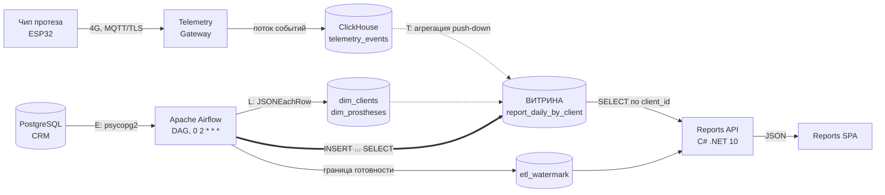

ЗАДАНИЕ 2. РАЗРАБОТКА СЕРВИСА ОТЧЁТОВ

Документ описывает архитектуру подготовки и выдачи отчётов о работе протеза (Задача 1) и реализацию: ETL в Airflow (Задача 2), бэкенд на C# (Задача 3), ограничение доступа (Задача 4), UI (Задача 5).
Опирается на Задание 1: аутентификация через Keycloak с PKCE S256 уже сделана, инициатива **I-3** (RBAC + скоуп данных) раскрывается здесь. Закрывает проблему **D1** (перегрузка единственной PostgreSQL) из Задания 1.

Статус: Accepted. Дата: 08-08-2026.
Диаграмма: [BionicPRO_C4_reports_to-be.drawio](BionicPRO_C4_reports_to-be.drawio) (C4, уровень Container).

---

## 1. Краткое резюме (TL;DR)

Отчёт нельзя считать в момент запроса: на одного клиента приходятся десятки тысяч событий телеметрии в сутки, а OLTP-база CRM уже деградирует под аналитической нагрузкой (D1). Поэтому вводится классическое разделение: **Airflow по расписанию готовит витрину в ClickHouse, а Reports API только читает готовые строки**.

Три решения, определяющие архитектуру:
1. **Витрина `report_daily_by_client` с `ORDER BY (client_id, report_date)`** — гранулярность «сутки × клиент». Первичный индекс даёт точечный доступ по пользователю: запрос за 30 дней читает 123 строки вместо 28 812 событий сырья.
2. **Идентификатор клиента берётся из токена (`bionic_client_id`), а не из запроса.** У основного эндпоинта `GET /reports` параметра «чей отчёт» не существует — IDOR структурно невозможен, а не «проверен».
3. **Водяной знак ETL (`etl_watermark`)** — API знает, по какую дату витрина посчитана, и на запрос «будущего» отвечает `409`, а не пустым отчётом.

Стенд поднимается `docker compose up -d --build` с последующим запуском DAG; фактические результаты проверок — в разделе 11.

---

## 2. Требования

Нумерация продолжает Задание 1 (F1–F5, NFR1–NFR8). Архитектурно значимые помечены **АЗТ**.

**Функциональные**
| Код | Требование | Реализация |
|---|---|---|
| F6 | Пользователь получает отчёт о работе своих протезов за выбранный период | `GET /reports?from&to` |
| F7 | Отчёт объединяет телеметрию с датчиков и данные клиента из CRM | витрина `report_daily_by_client` |
| F8 | Отчёт содержит и суточную детализацию, и агрегат за период | поля `daily[]` и `summary` |
| F9 | Пользователь видит, по какую дату данные готовы | `GET /reports/meta`, поле `data_ready_through` |
| F10 | Отчёт можно сохранить файлом | кнопка «Скачать JSON» в UI |

**Нефункциональные**
| Код | Требование | АЗТ |
|---|---|---|
| NFR9 | Отчёт формируется без вычислений в реальном времени — только чтение готовой витрины | **АЗТ** |
| NFR10 | Пользователь получает данные исключительно по своим протезам; чужой отчёт недоступен даже при подмене идентификатора | **АЗТ** |
| NFR11 | Неаутентифицированный запрос отчёта невозможен | **АЗТ** |
| NFR12 | Отчёт не отдаётся за период, который ETL ещё не обработал | **АЗТ** |
| NFR13 | Аналитическая нагрузка не затрагивает OLTP-базу CRM | **АЗТ** |
| NFR14 | Повторный запуск ETL за те же сутки не искажает витрину (идемпотентность) | |
| NFR15 | В OLAP попадает минимально необходимый объём ПДн | |

---

## 3. Задача 1. Архитектура решения

### 3.1. Поток данных



Телеметрия попадает в OLAP напрямую из шлюза — переносить её через Airflow бессмысленно, она уже в ClickHouse. ETL отвечает за **измерения из CRM** и за **построение витрины**.

### 3.2. Выбор OLAP-хранилища

| Критерий | PostgreSQL + индексы (as-is) | **ClickHouse (ВЫБОР)** | Elasticsearch | Greenplum |
|---|---|---|---|---|
| 1. Агрегация по млрд строк телеметрии | плохо — уже деградирует (D1) | профильная задача, колоночное сжатие | приемлемо, но дорого по RAM | хорошо |
| 2. Изоляция от OLTP | нет: та же БД | полная — отдельный контур | полная | полная |
| 3. Стоимость хранения телеметрии | высокая | низкая (сжатие 10–20×) | высокая (индексы > данных) | средняя |
| 4. Порог входа команды | нулевой | низкий: обычный SQL | свой DSL | требует DBA |
| 5. Лицензия / vendor lock-in | PostgreSQL | Apache 2.0, есть managed в РФ | SSPL (ограничения) | Apache 2.0, тяжёлый |
| 6. TTL и ретеншен «из коробки» | вручную | `TTL` на таблице | ILM | вручную |

**ВЫБОР: ClickHouse.** Обоснование: единственный вариант, который одновременно решает D1 (снимает аналитику с OLTP), даёт дешёвое хранение сырой телеметрии с автоматическим TTL и не требует новой квалификации — запросы остаются SQL. PostgreSQL отклонён потому, что проблема уже воспроизведена на практике: индексы не помогли. Elasticsearch — не аналитическая СУБД, агрегаты по числовым метрикам дороже и хуже. Greenplum избыточен для текущего объёма и требует отдельной эксплуатации.

### 3.3. Выбор структуры витрины

| Вариант | Плюсы | Минусы / почему не как основа |
|---|---|---|
| Агрегация «на лету» из сырья | нет ETL, всегда свежие данные | каждый отчёт — скан десятков тысяч строк; прямо нарушает NFR9 |
| Классическая звезда (факты + измерения, джойн в запросе) | гибкость произвольной аналитики | джойн на каждый запрос пользователя; для одного фиксированного отчёта — лишняя сложность |
| Materialized View поверх сырья | пересчёт автоматический | сложно пересчитать историю, `AggregatingMergeTree` усложняет чтение; отладка инкремента дороже DAG |
| **Широкая денормализованная витрина «сутки × клиент» (ВЫБОР)** | одна строка = один день пользователя; джойн уже выполнен в ETL; агрегат за период — сумма ≤ 366 строк | дублирование `full_name`/`city` в каждой строке; пересчёт истории при изменении логики |

**Итог: широкая суточная витрина** — потому что отчёт фиксирован по форме, а профиль доступа заранее известен: «один клиент, один диапазон дат».

Ключ сортировки задаёт скорость: `ORDER BY (client_id, report_date)` кладёт все дни одного клиента подряд, и первичный индекс ClickHouse сразу отсекает чужие гранулы.

```sql
ENGINE = ReplacingMergeTree(updated_at)
PARTITION BY toYYYYMM(report_date)
ORDER BY (client_id, report_date)
```

`ReplacingMergeTree(updated_at)` выбран ради NFR14: повторный запуск ETL за те же сутки не плодит дубликаты. Партиционирование по месяцу — чтобы отсечение по датам работало на уровне партиций, а старые периоды можно было удалять целиком.

Измерено на стенде (90 дней телеметрии, 4 протеза, 64 800 событий):

| Запрос «месяц по одному клиенту» | Прочитано строк | Прочитано байт |
|---|---|---|
| Из витрины `report_daily_by_client` | **123** | **1,8 КБ** |
| Та же агрегация по сырью с джойном | 28 812 | 394 КБ |

Разница ×220 по объёму чтения — и она растёт линейно с ростом истории, тогда как стоимость чтения витрины остаётся постоянной.

### 3.4. Где выполнять преобразование: ETL или ELT

| Вариант | Плюсы | Минусы / почему не как основа |
|---|---|---|
| Полный ETL в Python-воркере Airflow | вся логика в одном месте, легко тестировать | сырьё гоняется через воркер по сети; на реальных объёмах воркер станет узким местом |
| **Гибрид: E — Python, T+L — push-down в ClickHouse (ВЫБОР)** | измерения малы и извлекаются просто; тяжёлая агрегация идёт там, где лежат данные | логика преобразования живёт в SQL внутри DAG |
| Полный ELT (ClickHouse сам тянет CRM через `postgresql()`) | минимум кода | OLAP получает сетевой доступ в OLTP-контур с ПДн — лишняя связность и риск |

**Итог: гибрид.** Airflow оркеструет и извлекает измерения, ClickHouse выполняет `INSERT ... SELECT` с агрегацией — данные не покидают хранилище.

---

## 4. Задача 2. Airflow DAG

Файл: [airflow/dags/bionicpro_reports_etl.py](../airflow/dags/bionicpro_reports_etl.py)

**Расписание:** `0 2 * * *`. Запуск в день D обрабатывает `data_interval_start` = сутки D-1 — то есть только полностью завершённые сутки. Отсюда естественное отставание витрины на день, которое и фиксирует водяной знак.

**Граф задач:**

```
load_dim_clients ─┐
load_dim_prostheses ─┼─→ build_mart → data_quality → update_watermark
check_telemetry_ready ─┘
```

| Задача | Что делает | Зачем именно так |
|---|---|---|
| `load_dim_clients` | извлекает клиентов из CRM, грузит в `dim_clients` | в OLAP не уезжают email и полный номер договора (NFR15): договор маскируется до последних 4 символов |
| `load_dim_prostheses` | извлекает протезы, грузит в `dim_prostheses` | `telemetry_opt_in` управляет попаданием в витрину — пользователь может отключить сбор |
| `check_telemetry_ready` | проверяет наличие сырья за целевые даты | двигать водяной знак по пустому дню — значит соврать API о готовности данных |
| `build_mart` | `DELETE` + `INSERT ... SELECT` с агрегацией и джойном | `DELETE` перед вставкой даёт идемпотентность (NFR14) даже до слияния `ReplacingMergeTree` |
| `data_quality` | 4 проверки: непустота, `client_id != 0`, `recognition_rate ∈ [0;1]`, `recognized ≤ events` | без них в витрину можно молча положить мусор, и пользователь увидит его как «отчёт» |
| `update_watermark` | пишет min/max готовых дат | контракт с API (NFR12) |

**Перерасчёт истории** — тот же DAG с конфигурацией, без отдельного кода:

```bash
docker compose exec airflow airflow dags trigger bionicpro_reports_etl --conf '{"backfill_days": 90}'
```

**Состав витрины** (агрегаты в разрезе клиента за сутки): количество событий, доля распознанных движений, средняя и p95-задержка, число событий медленнее целевых 100 мс, минимальный и средний заряд батареи, качество миосигнала, число ошибок, часов активности, самый частый жест, количество протезов.

Набор выбран не «что посчиталось», а под две задачи пользователя: понять, **как протез работает у него** (распознавание, задержка, батарея) и **не пора ли на донастройку** (падение `recognition_rate`, рост `slow_events`).

Отдельно витрина хранит **сырые суммы** `latency_sum_ms`, `battery_sum_pct`, `emg_quality_sum`. Они нужны, чтобы агрегат за период считался взвешенно (`сумма / сумма`), а не как среднее суточных средних: иначе день с сотней событий весит столько же, сколько день с десятью тысячами, и «средняя задержка за месяц» перестаёт быть средней задержкой. Долевые показатели (`recognition_rate`, `slow_events_share`) по той же причине считаются из сумм, а не усреднением суточных долей.

---

## 5. Задача 3. Бэкенд отчётов (C#)

Каталог: [reports-api/](../reports-api/) — .NET 10, ASP.NET Core Minimal API.

| Метод | Назначение | Ответы |
|---|---|---|
| `GET /health` | проверка сервиса и доступности OLAP | `200` / `503` |
| `GET /reports/meta` | граница готовности данных | `200` |
| `GET /reports?from&to` | **отчёт по себе** | `200`, `401`, `403`, `409` |
| `GET /reports/{clientId}?from&to` | отчёт по явному идентификатору | `200` только для своего, иначе `403` |

Ключевые решения реализации:

- **Никаких вычислений в реальном времени (NFR9).** Запрос отчёта — это четыре коротких чтения из OLAP: водяной знак, суточные строки, агрегат за период (сумма не более 366 предагрегированных строк) и карточка клиента. Сырьё телеметрии не затрагивается вовсе.
- **Параметризованные запросы.** Значения передаются серверными параметрами ClickHouse (`{client_id:UInt64}` + `param_client_id=...`), подстановки в текст SQL нет — инъекция невозможна.
- **Отдельный read-only пользователь OLAP.** `reports_api` имеет `GRANT SELECT` на три таблицы и `readonly = 2`; проверено, что `INSERT` от его имени отклоняется. Компрометация сервиса не даёт изменить витрину.
- **Ошибки как коды, а не как пустой ответ.** `409` — период не обработан или не пересекается с витриной, `503` — витрина ещё не построена, `502` — OLAP недоступен. Пользователь получает причину, а не пустую таблицу.
- **Взвешенные средние за период.** Средняя задержка, заряд и качество сигнала считаются как `сумма / число событий`, а не усреднением суточных средних (см. раздел 4).

---

## 6. Задача 4. Ограничение доступа

Модель угрозы прямая: в Задании 1 утечка произошла именно из-за IDOR — аутентифицированный пользователь мог запросить чужие данные (проблема **B1**).

| Вариант | Плюсы | Минусы / почему не как основа |
|---|---|---|
| Проверка на фронтенде | быстро | запрос к API уходит напрямую; проверка на клиенте — не проверка |
| `client_id` в параметре запроса + сверка на сервере | привычный REST | защита держится на одной строке кода; забыли сверку в новом эндпоинте — снова утечка |
| Row-level security в ClickHouse по пользователю БД | защита на уровне хранилища | требует пользователя БД на каждого клиента — не масштабируется |
| **Идентификатор только из токена (ВЫБОР)** | параметра «чей отчёт» нет в контракте; забыть проверку негде | нужен protocol mapper в Keycloak и атрибут у пользователя |

**Итог: три независимых уровня.**

1. **Аутентификация** — `RequireAuthorization`, валидный JWT: подпись по JWKS, `iss`, `aud=reports-api`, срок жизни. Без токена — `401`.
2. **Авторизация (RBAC)** — политика требует роль `prothetic_user` из `realm_access.roles`. Роль `user` получает `403`.
3. **Скоуп данных** — `client_id` берётся из claim `bionic_client_id`, который выпускает Keycloak по атрибуту пользователя. Значение попадает прямо в `WHERE client_id = {client_id:UInt64}`.

Эндпоинт `GET /reports/{clientId}` оставлен намеренно — как исполняемая демонстрация требования: при несовпадении он пишет запись в аудит-лог и возвращает `403`.

Связка «учётная запись ↔ клиент CRM»: пользователь Keycloak `prothetic1` → атрибут `bionic_client_id = 1001` → `clients.client_id = 1001` в CRM. Атрибутом управляет IdP, приложение его только читает.

---

## 7. Задача 5. UI

Файл: [frontend/src/components/ReportPage.tsx](../frontend/src/components/ReportPage.tsx)

- Кнопка **«Получить отчёт»** вызывает `GET /reports` с `Authorization: Bearer`; перед запросом токен обновляется (`updateToken(30)`), чтобы не отправить протухший.
- Выбор периода: 7 / 30 / 90 дней. Верхняя граница берётся из `data_ready_through`, поэтому запросить необработанный период из интерфейса нельзя в принципе — а если сделать это в обход UI, ответ будет `409`.
- Отображаются карточки агрегата (события, распознавание, задержка, доля медленнее 100 мс, худший p95, батарея, ошибки, частый жест) и суточная таблица.
- Кнопка **«Скачать JSON»** сохраняет отчёт файлом (F10).
- Если у учётной записи нет роли `prothetic_user`, вместо кнопки показывается объяснение — без обращения к API.
- Ошибки переводятся в человеческие формулировки: истёкшая сессия, нет роли, период не готов, витрина не построена.

---

## 8. Период, ещё не обработанный Airflow

Требование выделено отдельно, потому что его легко «реализовать» неправильно — вернув пустой отчёт, который пользователь прочитает как «протез не работал».

Механика:

1. `update_watermark` после каждого успешного прогона пишет в `etl_watermark` фактические `min/max` дат витрины.
2. `ReportService` читает водяной знак **до** запроса данных.
3. Логика ответа:

| Ситуация | Ответ |
|---|---|
| Период целиком позже `max_ready_date` | `409 Conflict` + текст «витрина готова по <дата> включительно» |
| Период частично выходит за границу | `200`, период усечён; в ответе `clamped: true`, `requested_from/to` и пояснение `note` |
| Период частично раньше `min_ready_date` | нижняя граница поднимается до готовой даты, `clamped: true` |
| Период **целиком** раньше `min_ready_date` | `409` «период не пересекается с данными витрины» |
| Витрина пуста (ETL не запускался) | `503` с указанием запустить DAG |
| Период длиннее 366 дней | усечение — защита от запроса «всей истории» |

Усечение с явной пометкой выбрано вместо тихого урезания: клиент видит и что просил, и что получил.

Умолчания границ подобраны так, чтобы «будущий» запрос не превращался в валидный: если задана только одна граница, вторая достраивается окном в 30 суток **от неё**, а не водяным знаком. Иначе `?from=2027-01-01` вывернулся бы в диапазон «водяной знак … 2027-01-01» и вместо честного `409` вернул бы один день данных.

---

## 9. Компромиссы и ограничения

- **Отставание данных на сутки.** Отчёт не показывает сегодняшний день — это следствие суточной гранулярности. Если бизнесу понадобится «сегодня», путь эволюции: добавить инкрементальный прогон раз в час для текущих суток и отдавать его отдельным блоком «предварительные данные».
- **`FINAL` при чтении `ReplacingMergeTree`.** Даёт корректность до фонового слияния, но дороже обычного чтения. На объёмах витрины (сотни строк на запрос) это незаметно; при росте — перейти на `argMax` по `updated_at` или на явное версионирование.
- **Денормализация ФИО и города в каждой строке витрины.** Переименование клиента отразится только на пересчитанных днях. Осознанный размен ради отсутствия джойна в горячем пути.
- **Один DAG на все страны.** При выходе на новые рынки (Задание 1, решение 3) DAG нужно разворачивать в каждом региональном контуре со своими подключениями — код тот же, конфигурация разная.
- **Секреты в `docker-compose.yaml` и `appsettings.json`.** Приемлемо для учебного стенда; в prod — секреты оркестратора или vault.
- **Телеметрия на стенде сгенерирована** детерминированным SQL-скриптом ([clickhouse/init/02_seed_telemetry.sql](../clickhouse/init/02_seed_telemetry.sql)) вместо реального шлюза. Даты привязаны к `today()` на момент инициализации ClickHouse, поэтому диапазон витрины смещается вместе с датой запуска стенда.
- **`top_gesture` за период — приближение.** Витрина не хранит гистограмму жестов, только лидера суток, поэтому за период возвращается жест, чаще всего лидировавший по дням. Это не обязательно самый частый жест за период. Точный ответ потребовал бы хранить `Map(String, UInt64)` с подсчётом по жестам и складывать его через `sumMap` — усложнение витрины ради второстепенного поля сочтено неоправданным. Суточное значение точное.
- **Водяной знак — это диапазон, а не гарантия отсутствия пропусков внутри.** Пропуски легальны: если пользователь не пользовался протезом, суток в витрине не будет. Скрытый пропуск из-за сбоя невозможен для планового запуска — `update_watermark` стоит ниже по графу и не выполняется, если `build_mart` или проверки качества упали.
- **`REACT_APP_*` в `docker-compose.yaml` не влияют на собранный фронтенд.** CRA подставляет их на этапе `npm run build`, то есть фактические значения берутся из [frontend/.env](../frontend/.env); переменные в compose оставлены совпадающими, чтобы не расходиться. Менять адрес API нужно в `.env` с пересборкой образа.

---

## 10. Кросс-срезы

**Безопасность и ПДн.** В OLAP уезжает минимум персональных данных: без email, номер договора маскирован (NFR15). Reports API ходит в ClickHouse read-only пользователем. CORS ограничен origin'ом фронтенда — проверено, что для чужого origin заголовок не выдаётся. Отказы в доступе пишутся в аудит с именем пользователя и запрошенным идентификатором.

**Retention.** Сырьё `telemetry_events` — `TTL 90 дней` на уровне таблицы: дальше живут только агрегаты витрины, которые в сотни раз компактнее. Витрина партиционирована по месяцам, поэтому старые периоды удаляются отсечением партиции, а не мутацией.

**Наблюдаемость.** RED по Reports API; метрики DAG — длительность, число обработанных суток, результат data-quality; алерт на «водяной знак не двигался > 26 часов» (значит, расписание сломалось, а API продолжает молча отдавать старые данные — самый опасный тихий отказ в этой схеме).

| Метрика | WARNING | CRITICAL | Почему такой порог |
|---|---|---|---|
| Отставание водяного знака | > 26 ч | > 50 ч | Норма — сутки + запуск в 02:00; двое суток = пропущено два прогона |
| Доля `409` в ответах `/reports` | > 5 % | > 20 % | Массовые `409` = витрина отстала, а не пользователи ошибаются |
| Длительность DAG | > 15 мин | > 40 мин | Рост говорит о том, что окно пересчёта перестаёт помещаться в ночь |
| Ошибки data-quality | ≥ 1 | ≥ 1 за 2 прогона подряд | Одна осечка — расследование, две подряд — витрине нельзя верить |

**Надёжность.** `retries: 2` у задач DAG; `max_active_runs: 1` исключает одновременный пересчёт одних суток; идемпотентность `build_mart` делает повтор безопасным; недоступность ClickHouse даёт `502`, а не некорректный отчёт.

**Метрики решения**
Технические: строк, прочитанных на один отчёт → 123 вместо 28 812 (×220 по объёму); время ответа `/reports` — медиана 19 мс за 30 суток и 21 мс за 89 суток (измерено на стенде); аналитических запросов к OLTP CRM → 0 (закрывает D1); успешных выдач чужого отчёта → 0.
Бизнесовые: доля пилотов, хоть раз скачавших отчёт (обещание, данное в рамках урегулирования исков); доля отчётов с падением `recognition_rate` → повод пригласить на донастройку до того, как человек столкнётся с неудобством.

---

## 11. Проверка

Стенд поднимается одной командой; последовательность и фактические результаты ниже.

```bash
docker compose down -v
rm -rf postgres-keycloak-data          # realm импортируется только в пустую БД
docker compose up -d --build
# первичное наполнение витрины историей
docker compose exec airflow airflow dags trigger bionicpro_reports_etl --conf '{"backfill_days": 90}'
```

Результаты ниже сняты 08-08-2026. Конкретные даты смещаются вместе с датой запуска стенда: телеметрия генерируется относительно `today()`.

**ETL.** Все шесть задач DAG — `success`. Витрина: **267 строк, 3 клиента, 2026-05-12 … 2026-08-08** (89 суток × 3 клиента) из 64 800 событий телеметрии. Водяной знак совпадает с этим диапазоном; текущие сутки в витрину не попадают.

**Идемпотентность (NFR14).** Повторный запуск того же перерасчёта: **267 строк до и 267 после**, причём одинаково при чтении с `FINAL` и без него; дубликатов по ключу `(client_id, report_date)` — 0. То есть `DELETE` перед вставкой отрабатывает синхронно, а не только маскируется схлопыванием `ReplacingMergeTree`.

**Корректность цифр — сверка с сырьём.** Агрегат отчёта сопоставлен с независимым запросом к `telemetry_events` в обход витрины (клиент 1001, 31 сутки):

| Показатель | API (витрина) | Эталон (сырьё) |
|---|---|---|
| events_total | 11 160 | 11 160 |
| gestures_recognized | 10 391 | 10 391 |
| recognition_rate | 0,9311 | 0,9311 |
| avg_latency_ms | 68,93 | 68,93 |
| slow_events | 582 | 582 |
| battery_avg_pct | 65,42 | 65,42 |
| battery_min_pct | 28 | 28 |
| emg_quality_avg | 0,791 | 0,791 |
| errors_count | 228 | 228 |

Совпадение по всем девяти показателям. Оговорка: на сгенерированных данных суточная нагрузка равномерна, поэтому взвешенное среднее численно совпало со средним суточных средних — на реальных неравномерных данных они разойдутся, и корректен именно взвешенный расчёт.

**API и разграничение доступа** (токены получены реальным логином через Authorization Code + PKCE):

| # | Проверка | Результат |
|---|---|---|
| 1 | `GET /reports/meta` | `200`, готово с 2026-05-12 по 2026-08-08 |
| 2 | `GET /reports` **без токена** | `401` |
| 3 | `GET /reports` пользователем `user1` (роль `user`) | `403` |
| 4 | `GET /reports` пользователем `prothetic1` | `200`, `client_id=1001`, «Иванов Иван Иванович», 30 суток, 10 800 событий, период 2026-07-10…2026-08-08 |
| 5 | `GET /reports/1001` пользователем `prothetic1` (свой) | `200` |
| 6 | `GET /reports/1002` пользователем `prothetic1` (**чужой**) | `403` «Отчёт доступен только в отношении собственных протезов» |
| 7 | `GET /reports` пользователем `prothetic2` | `200`, `client_id=1002`, «Петрова Мария Сергеевна» — свои данные |

Состав токена `prothetic1`: `aud=reports-api`, `realm_access.roles=['prothetic_user']`, `bionic_client_id=1001`.

**Границы периода (NFR12).**

| Запрос | Результат |
|---|---|
| `?from=2027-01-01&to=2027-01-31` (целиком будущее) | `409` «Данные за период с 2027-01-01 ещё не обработаны. Витрина готова по 2026-08-08 включительно» |
| `?from=2027-01-01` (только нижняя граница, будущее) | `409` — окно достраивается от `from`, а не водяным знаком |
| `?to=2027-01-31` (только верхняя граница, будущее) | `409` |
| `?from=2026-08-01&to=2027-01-31` (частично) | `200`, отдано 2026-08-01…2026-08-08, `clamped=true` |
| `?from=2020-01-01&to=2020-02-01` (целиком до витрины) | `409` «период не пересекается с данными витрины» |
| `?from=2026-08-05&to=2026-08-01` (перевёрнутый) | `200`, нормализован в 2026-08-01…2026-08-05 |
| `?from=2000-01-01&to=2026-08-08` (вся история) | `200`, усечён до 2026-05-12…2026-08-08, 89 суток |
| без параметров | `200`, последние 30 готовых суток |

**Прочее.** Запись в ClickHouse от имени `reports_api` отклонена (`ACCESS_DENIED`). CORS: Reports API выдаёт заголовок только для `http://localhost:3000`; со статики SPA убран `Access-Control-Allow-Origin: *` — это закрывает часть проблемы **A4** из Задания 1. Проверено, что механизмы Задания 1 не сломались: запрос `/auth` без `code_challenge_method` по-прежнему отклоняется, ROPC возвращает `unauthorized_client`. UI собирается и отдаёт страницу на `http://localhost:3000`.

Адреса стенда: UI `:3000`, Reports API `:8000`, Keycloak `:8080` (`admin/admin`), Airflow `:8081` (`admin/admin`), ClickHouse `:8123`.
Пользователи: `prothetic1..3 / prothetic123` (роль `prothetic_user`, клиенты 1001–1003), `user1 / password123` (роль `user`, отчёты недоступны).

---

## 12. Заключение

Выбран путь **«готовим заранее — отдаём готовое»**: Airflow строит суточную витрину в ClickHouse, Reports API её только читает. Это единственная схема, которая одновременно закрывает NFR9 (нет вычислений в реальном времени) и NFR13 (аналитика не трогает OLTP CRM), то есть решает исходную проблему D1, а не переносит её в другой сервис.

Разграничение доступа построено не на проверке параметра, а на его отсутствии: идентификатор клиента приходит из подписанного токена. Это делает повторение прошлогодней утечки невозможным по конструкции, а не по внимательности разработчика.

Эволюция: при росте числа пилотов — партиционирование витрины по месяцам уже заложено, добавится шардирование по `client_id`; при запросе «данных за сегодня» — часовой инкрементальный прогон поверх той же витрины; при выходе на новые рынки — региональная копия контура отчётности вместе с периметром из Задания 1.
